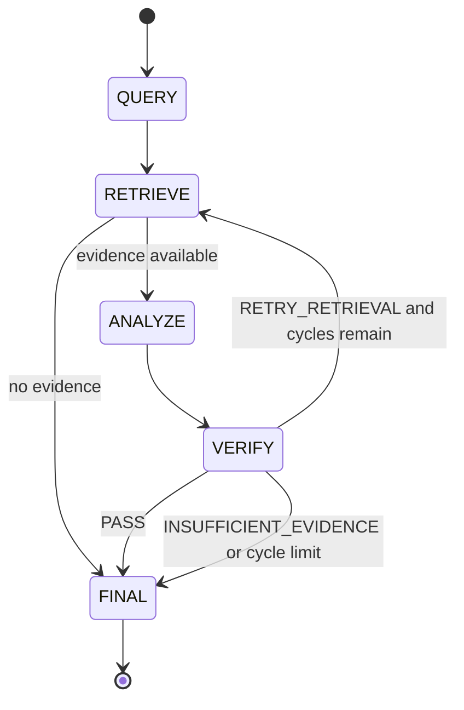

# NERV agent architecture

> **Experimental Stage 2.** This layer is separate from the deterministic
> CODEFEST Stage-1 ingestion-to-retrieval route and is not imported by the
> Stage-1 generator. Its presence does not change the current Stage-1 release
> status.

## Purpose

The agent layer converts a user question into a grounded answer while keeping
NERV retrieval evidence traceable. It is provider-neutral and does not connect
to the production FAISS index in this version.

## Three logical agents

- **Retriever Agent:** issues one conservative search per cycle through a
  `RetrievalBackend`, attaches the retrieval query when absent, and deduplicates
  chunks by `chunk_id` while preserving the first result's rank and metadata.
  It never generates an answer.
- **Analyst Agent:** asks an injected `AnalysisBackend` for a structured
  `DraftAnswer`. It receives the original query, accumulated evidence, and
  optional verifier feedback. It rejects every citation not present in its
  supplied evidence.
- **Verifier Agent:** asks an injected `VerificationBackend` to classify the
  draft as `PASS`, `RETRY_RETRIEVAL`, or `INSUFFICIENT_EVIDENCE`. It does not
  rewrite the draft.

The protocols contain no network calls and name no LLM provider. Deterministic
test doubles implement the same protocols in unit tests.

## Contracts

`AgentQuery` identifies the original question. `RetrievalRequest` and
`RetrievalResult` bind each cycle to ranked `RetrievedEvidence`. Each evidence
record carries `chunk_id`, `doc_id`, `source`, `rank`, `text`, optional `score`,
and optional `retrieval_query`.

`DraftAnswer` contains text plus one or more `EvidenceCitation` records and an
optional confidence value in the range 0 through 1. `VerificationResult`
contains a bounded status plus unsupported claims, missing evidence, and an
optional retrieval focus. `AgentAnswer` contains only accepted cited evidence
for a passing answer; an insufficient-evidence answer contains no accepted
citations. `AgentRunTrace` records state transitions, retrieval requests,
evidence IDs per request, and verifier outcomes. `AgentRunResult` pairs the
answer and trace.

## Retry policy

The orchestrator permits two retrieval/verification cycles by default. The
limit is configurable but must be positive. A verifier-supplied retrieval focus
is used for the next search; when absent, the original query is reused. Evidence
is accumulated and deduplicated across cycles. A retry requested at the limit
becomes an explicit insufficient-evidence result.

## Grounding invariants

1. The analyst can cite only evidence it received.
2. A passing final answer must contain at least one retrieved citation.
3. Final cited evidence is selected from accumulated retrieved evidence.
4. Empty retrieval bypasses analysis and returns insufficient evidence.
5. The verifier classifies support but never silently edits the draft.
6. Retrieval retries are bounded.
7. The trace retains the query-to-retrieval-to-verification path.

## Current mock boundary

Unit tests inject in-memory retrieval, analysis, and verification backends. No
GPU, model, network, API key, FAISS index, corpus, or generated run artifact is
read. This boundary demonstrates deterministic orchestration only and is not a
production retrieval pass.

## Future NERV production retrieval adapter

The next integration task must implement `RetrievalBackend.search` by adapting
the accepted NERV retrieval subsystem. It must be given and identity-validate:

- the accepted clean chunks JSONL path;
- the accepted clean FAISS index path and its manifest;
- the exact encoder and query tokenizer configuration;
- the canonical query prefix (`query: `);
- the requested `top_k` and the production ranking policy;
- the exact row-to-chunk metadata mapping between every FAISS position and the
  corresponding clean chunk.

The adapter must map existing NERV fields into `RetrievedEvidence`, preserve
scores and ranks, reject identity or alignment mismatches, and remain separate
from answer generation. It must be wired only after `CLEAN_DOWNSTREAM_PASS`.
